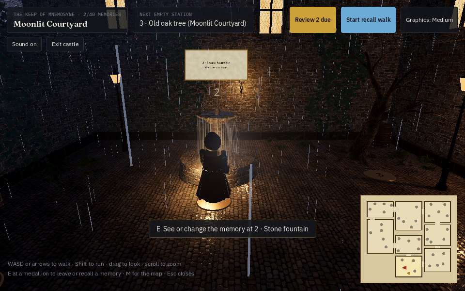
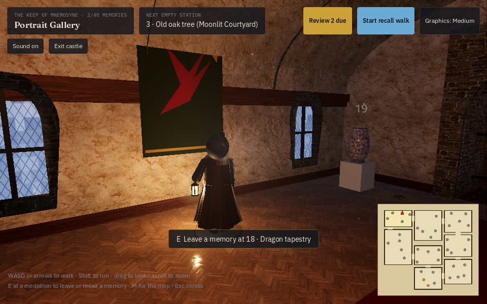

# Mnemosyne: the native app (Godot)

This folder is the whole of Mnemosyne rebuilt as a native app in [Godot 4.7](https://godotengine.org): the walkable 3D castle, your own palaces, the curriculum, the library, the drills and number systems. It is free and open source. One project builds for Windows, Linux, Android and the web, and Godot can also export it for macOS and iOS.

| | |
|---|---|
|  |  |

## Running it

1. Install Godot 4.7 (the standard build, not .NET).
2. Open Godot, choose **Import**, and select `godot/project.godot`.
3. Press **F5** (or the play button).

From a terminal: `godot --path godot`.

## Your memories are safe

- Everything is saved on your device as you go (`user://mnemosyne.json`; on Windows that's under `%APPDATA%\Godot\app_userdata\Mnemosyne`). Each save is written to a temporary file first and then swapped in, so a crash can't leave a half-written file.
- The first save each day keeps a copy of the day before. **Backup** lists these copies and can restore any of them.
- **Backup → Export** writes everything to one `.json` file. Import it on any device, in this app or the web version. You can merge it with what's there or replace it, and the current data is copied aside before a replace.
- Every memory has its own review schedule (FSRS-5). Each station and library item comes up for review when you're about to forget it, rather than a whole palace at once. Recall walks grade each memory **Missed it / Hard / Got it / Easy**.

## The castle

You walk a hooded keeper with a lantern through eight rooms and 40 numbered stations. Step onto a station's brass medallion and press **E** to leave a memory there: text, a picture, or both. **Start recall walk** sends you back to the gate to walk the route forward-only and grade yourself at each station. **Review due** walks only the memories that are due.

- **Controls:** WASD or the arrow keys to walk, Shift to run, drag to look, scroll to zoom, **M** for the map, Esc to leave. While studying, tap a station on the big map to go straight there. Phones get a thumb-stick and a Use button, drag to look and pinch to zoom.
- **Graphics:** High uses real-time global illumination (SDFGI), ambient occlusion and indirect light (SSAO/SSIL), volumetric fog and soft shadows. Medium and Low are for weaker machines, and the castle steps down by itself if frames get slow. Phones and the web use the lighter renderers automatically.
- **Sound:** rain, fire, wind and room tone are synthesised live, so there are no audio files.
- **Assets:** every model and texture is CC0 from [Poly Haven](https://polyhaven.com) (`assets/castle/CREDITS.md`). They're converted from the web version's files by `npm run godot-assets` (`scripts/godot-assets.mjs`).

## Project layout

```
project.godot          settings: autoloads, renderers, input
data/content.json      curriculum, drills, word lists and the castle layout, exported from
                       the web app by `npm run godot-data`, so both teach the same
scripts/core/          data: DB (save, snapshots, import/export), FSRS, backup format, logic
scripts/ui/            theme, the app window (tabs, modals, toasts), widgets
scripts/views/         one script per screen; recall_session.gd runs graded recall
scripts/castle/        the 3D castle
  castle.gd            builds it and runs the walk, panels and recall
  layout.gd            the floor plan (rooms, doors, stations) from content.json
  architecture.gd      walls, floors, vaults, roofs, windows, turrets
  props.gd decor.gd    the 40 station objects and the room furnishings
  stations.gd          medallions, numbers and memory cards
  doors.gd keeper.gd   swinging doors; the keeper
  player.gd            movement, collision and the camera
  atmosphere.gd        sky, fog, global illumination, rain, embers, sound
  castle_hud.gd        on-screen labels, buttons, map and thumb-stick
shaders/               world-mapped surfaces, the night sky, the fountain
tests/                 headless test suite
tools/shot.gd          screenshots of any screen, for review
```

## Tests

```bash
godot --headless --import --path godot            # once, after cloning
godot --headless --path godot --scene res://tests/test_runner.tscn
```

The suite runs 216 checks in under a minute, with no window. It covers every script compiling, the FSRS scheduler, backup and restore, the data logic, and every screen driven like a user would. It also covers the castle: building it, walking into walls, doors opening, leaving a memory and a full recall walk.

Screenshots for review (needs a display, or `xvfb-run`):

```bash
godot --path godot --scene res://tools/shot.tscn -- out "seed;dashboard;castle:{'at':12}"
```

## Builds

The **Godot app** workflow (`.github/workflows/godot.yml`) runs the tests on every push that touches `godot/`. It then exports Linux, Windows, Web and Android builds and attaches them to the run as downloads. The Android build is a debug-signed APK. Release signing and store uploads need your own keys and come later. macOS and iOS exports need a Mac, so they aren't in CI yet.

To export locally, install the export templates (**Editor → Manage Export Templates**), then use **Project → Export**.

## Not ported yet

- PDF import in the Library. Text and `.txt` files work; for a PDF, paste its text for now.
- AI image suggestions for library items.
